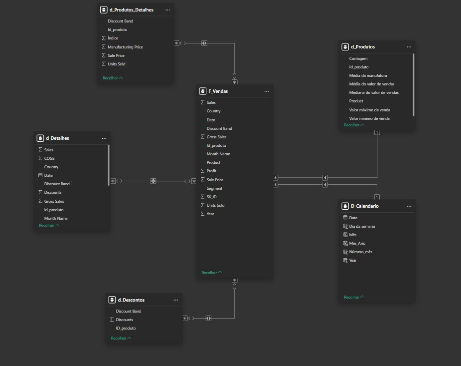

# 📊 Modelo Star Schema - Financial Sample

## 🧩 Descrição do Projeto
Este projeto foi desenvolvido como parte de um desafio prático da DIO com o objetivo de **construir um modelo de dados no formato Star Schema** a partir de uma tabela única denominada **Financial Sample**.  

O processo consistiu em analisar a base original, identificar colunas relevantes e criar novas tabelas dimensão e fato, estruturando o modelo de forma otimizada para análises no Power BI.

---

## 🗂️ Estrutura do Projeto
A partir da tabela original **Financials_origem**, foram criadas as seguintes tabelas:

- **F_Vendas** (Tabela Fato): contém os dados transacionais de vendas, como produto, quantidade vendida, preço, desconto, lucro e data.  
- **D_Produtos**: informações agregadas dos produtos, incluindo médias e medidas estatísticas de vendas.  
- **D_Produtos_Detalhes**: detalhes adicionais sobre produtos, como faixa de desconto, preço de venda, preço de manufatura e unidades vendidas.  
- **D_Descontos**: informações sobre descontos e faixas de desconto aplicadas por produto.  
- **D_Detalhes**: tabela criada para consolidar informações complementares de vendas que não se enquadram nas demais dimensões.  
- **D_Calendario**: tabela de datas criada via DAX para análises temporais.  

---

## ⚙️ Etapas de Construção

1. **Importação da base Financial Sample**  
   A base original foi carregada no Power BI como `Financials_origem` (modo oculto, para servir como backup e referência).

2. **Criação das tabelas dimensão e fato**  
   Foram criadas novas tabelas a partir da `Financials_origem`, com seleção de colunas relevantes e inclusão de campos calculados para atender ao modelo estrela.

3. **Criação de relacionamentos**  
   Os relacionamentos foram estabelecidos principalmente através do campo **ID_Produto**, conectando as tabelas dimensão à tabela fato `F_Vendas`.

4. **Criação da Tabela de Calendário (DAX)**  
   A tabela calendário foi criada para permitir análises temporais e utilização de funções de tempo no Power BI.

   ```DAX
   D_Calendario = CALENDARAUTO(12)
   Ano = YEAR('D_Calendario'[Date])
   Número_Mês = MONTH('D_Calendario'[Date])
   Dia_da_Semana = WEEKDAY('D_Calendario'[Date])
   Mês = FORMAT(DATE(1,'D_Calendario'[Número_mês],1), "MMM") 
   Mês_Ano = MONTH('D_Calendario'[Date]) & "-" & YEAR('D_Calendario'[Date])
   ```
   
## 📈 Modelo Star Schema

Abaixo está o diagrama do modelo estrela construído no Power BI:



---

## 🧠 Funcionalidades e Funções Utilizadas

### 🧮 Funções DAX
- `CALENDARAUTO()` → utilizada para criação automática da tabela de datas.  
- `YEAR()`, `MONTH()`, `WEEKDAY()`, `FORMAT()` e concatenação → usadas para formatação e derivação de campos temporais.

### 🔗 Relacionamentos
- Relacionamentos entre as dimensões e a tabela fato via `ID_Produto`.  
- A tabela `D_Calendario` foi conectada à `F_Vendas` através do campo `Date`.

### 📊 Modelagem Dimensional
- Separação clara entre tabelas de **dimensão** e **fato**.  
- Estruturação otimizada para análise, facilitando o uso de medidas, segmentações e painéis no Power BI.

---

## 💬 Conclusão

O modelo foi construído seguindo **boas práticas de modelagem dimensional**, proporcionando uma estrutura organizada, eficiente e de fácil manutenção.  

O objetivo principal foi demonstrar a **transformação de uma tabela única em um modelo analítico completo**, capaz de suportar visualizações e indicadores de desempenho no Power BI.

